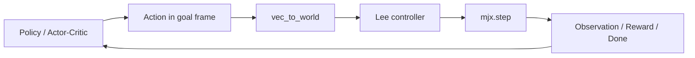

# NavRL 复现总结（MJX 迁移版）

## 1. 项目定位与迁移结论

本项目复现的是论文《NavRL: Learning Safe Flight in Dynamic Environments》， IEEE Robotics and Automation Letters (RA-L), 2025 对应的导航强化学习思路，参考基线是 [Zhefan-Xu/NavRL](https://github.com/Zhefan-Xu/NavRL.git)。原论文主要在 Isaac Sim 中训练，本项目则把任务语义、观测设计、控制逻辑和训练框架迁移到 MuJoCo XLA（MJX）+ JAX 上。

工程完成度：

1. 训练闭环已经打通，入口、环境、PPO、评估和 checkpoint 都形成链路。
2. 8D 简化路线和 full 多模态路线都能训练，且 full 路线已经把静态障碍物、动态障碍物、LiDAR 和碰撞语义闭起来。
3. 并行主线符合 MJX / JAX 的典型范式，即环境维 `vmap`、时间维 `scan`、训练与评估 `jit`。



## 2. 工程总览

| 模块 | 作用 | 关键文件 |
|---|---|---|
| 配置与入口 | 合并默认配置、route 覆盖、训练与评估启动 | [training/train.py](training/train.py#L109), [configs/default.yaml](configs/default.yaml), [configs/routes.yaml](configs/routes.yaml) |
| 环境与观测 | 8D 简化环境、full 多模态环境、自动重置、动态障碍物 | [envs/navigation_env.py](envs/navigation_env.py#L339), [envs/lidar.py](envs/lidar.py), [envs/mjcf_scene.py](envs/mjcf_scene.py), [envs/obstacle_generator.py](envs/obstacle_generator.py) |
| 控制器 | 速度指令到电机推力的 Lee 控制器 | [controllers/lee_controller.py](controllers/lee_controller.py) |
| 网络 | Beta Actor-Critic，full 路线带 LiDAR CNN 与动态障碍物 MLP | [networks/actor_critic.py](networks/actor_critic.py) |
| PPO | rollout 收集、GAE、PPO update、值归一化 | [training/ppo.py](training/ppo.py) |
| 评估 | checkpoint 加载、任务预设、路线兼容恢复 | [training/eval.py](training/eval.py) |
| 运行脚本 | GPU 保护、JAX 缓存、后台训练 | [run_full.sh](run_full.sh) |

项目把大部分计算都压进了 JAX 图里。训练靠的是批量化、静态图和少量边界同步。

## 3. MuJoCo / MJX 技能栈

MJX 的核心思路：把静态模型和动态状态拆开，把大量相同物理实例批量化，让 XLA 去编译这些规则计算。

| 技能 / 特性 | 在本项目中的落点 | 容易踩坑的点 |
|---|---|---|
| `mjx.Model` / `mjx.Data` 分离 | 模型结构、静态场景、约束拓扑放在 `Model`，逐步更新的物理状态放在 `Data` | 场景结构变化后，旧的 `Data`、旧的闭包和旧的 JIT 缓存都不能继续复用 |
| `mjx.put_model` / `mjx.put_data` / `mjx.make_data` | 把 CPU 端的 MuJoCo 模型和数据放到设备上，供 JAX 图中计算 | 不要手工拼装 `mjx.Data`，仍以出错，尽量多阅读官方文档，通过官方 API 创建 |
| `mjx.step` / `mjx.forward` / `mjx.kinematics` | `step` 负责推进仿真，`forward` 负责刷新传感器，`kinematics` 用在快速重置里 | 以为只改了 `qpos` 就能直接读到传感器，实际上要重新推进或至少刷新运动学量 |
| `mjx.ray` | full 路线的静态 LiDAR 使用真实场景 raycast | 传感器与物理场景的几何组、body 排除和注入方式必须一致，否则雷达仿真失效无法训练 |
| `geomgroup` / `bodyexclude` / `contype` / `conaffinity` | 隔离无人机、地面、静态障碍物和动态障碍物的碰撞逻辑 | 过滤掩码错了，常见现象是“看得见障碍但碰撞 / 射线对不上” |
| `hfield` / `box` 场景表示 | 静态障碍物可以真实注入 MuJoCo 场景，或者栅格化成 heightfield | 选错表示方式会影响 raycast、碰撞和性能，导致训练无比缓慢 |
| `mocap` 动态障碍物 | 动态障碍物通过写 `mocap_pos` / `mocap_quat` 进入场景 | 只更新位置但没同步场景数据，LiDAR 和碰撞会产生语义漂移 |
| checkpoint manifest | 保存 `obs_mode`、`route`、`env_config`、`ppo_config`、`scene_version` 等 | 存元信息，减少手动配置错误 |

MJX 最擅长的场景：大量同构环境、固定结构、需要高吞吐量 rollout 的强化学习，它对单场景仿真、频繁结构变化、很重的接触搜索、超大网格碰撞都不友好，所以这个项目最后选择了静态几何 + batch 动态状态的路线。

## 4. 环境、感知与控制链路

把“策略输出什么”和“物理引擎真正接收什么”分离开。策略输出的是目标坐标系下的速度指令，随后经过坐标变换和 Lee 控制器，最终转成 MJX 的执行器控制量。

### 4.1 8D 观测的语义

8D 观测的核心是目标坐标系表达，具体是：

$$
o_{8d} = [r^{g}_{pos}(3), d_{xy}(1), d_z(1), v^{g}(3)]
$$

其中 `rpos_clipped_g` 是相对目标方向在 goal frame 下的单位向量，`distance_2d` 和 `distance_z` 是水平和垂直距离，`vel_g` 是速度在 goal frame 下的表达。

### 4.2 full 多模态观测

full 观测由四部分组成：`state(8D) + lidar(1×36×4) + direction(3D) + dynamic_obs(5×10)`。其中：

| 分量 | 作用 |
|---|---|
| `state` | 与 8D 路线一致的几何与速度摘要 |
| `lidar` | 36 个水平射线 × 4 个垂直射线，共 144 条，表示局部障碍空间 |
| `direction` | 目标方向的归一化向量，保留接口一致性，实际上不直接参与网络拼接 |
| `dynamic_obs` | 最近 5 个动态障碍物的 10 维特征，包括相对位置、距离、速度、宽高类别 |

静态障碍物优先走真实场景 `mjx.ray()`，动态障碍物默认保持 AABB 软件求交，但也可以在动态几何体注入场景后走真实 ray。好处是，静态场景和物理碰撞保持一致，动态障碍物又不至于把射线代价抬得过高。

### 4.3 控制器链路

动作管道是：

$$
a_{norm} \in (0,1)^3 \rightarrow a_{goal} = 2 a_{norm} \cdot a_{limit} - a_{limit}
$$

然后 `vec_to_world` 把目标坐标系速度变成世界坐标速度，Lee 控制器再把速度误差变成姿态、角速度和总推力，最后得到四个电机的 MJX 控制量。

一种很实用的分层控制思想，策略学的是“飞向哪里、飞多快”，控制器负责“怎么把这个速度安全地变成旋翼推力”。能显著降低策略学习难度。

### 4.4 场景重建与自动重置

静态障碍物不是每一步都重新生成，而是在训练开始时生成一次，必要时按低频间隔重建。重建后，代码会显式丢弃旧的环境状态并重建训练 / 评估闭包。

自动重置则采用 branchless 路径：done 的环境直接用新采样状态替换，未 done 的环境继续沿用原状态。这样可以把 episode 重启留在 JAX 图里，减少 Python 分支开销。

## 5. 强化学习网络的理解

### 5.1 Beta policy

这个项目的策略不是高斯分布，而是 Beta 分布。原因很直接：动作本来就被限制在 `(0,1)` 里，再通过线性缩放映射到速度区间 `[-a_{limit}, a_{limit}]`。如果用 Beta，动作域和分布支撑天然一致，不需要额外做 `tanh` squash 及其概率修正，训练时更容易保持数值稳定。

Beta policy 的参数化是：

$$
\alpha = 1 + \mathrm{softplus}(f_\alpha(x)) + \varepsilon,
\quad
\beta = 1 + \mathrm{softplus}(f_\beta(x)) + \varepsilon
$$

这里的一个细节是，`alpha` 和 `beta` 都被强制大于 1。我的理解是，这会让分布更偏向单峰、平滑和中间区域，避免策略一开始就过度偏向边界动作。对于导航任务来说，这很合理，因为边界动作往往对应更激进的速度指令，而项目目标更像是稳定地朝目标移动，而不是在动作边界上赌博。

### 5.2 Actor-Critic + GAE + PPO

PPO 的核心目标是控制策略更新步幅：

$$
L^{CLIP}(\theta) = \mathbb{E}_t\left[
\min\left(r_t(\theta)\hat A_t,
\mathrm{clip}(r_t(\theta), 1-\epsilon, 1+\epsilon)\hat A_t\right)
\right]
$$

其中 `r_t(θ)` 是新旧策略概率比，`Â_t` 是优势函数。这个目标的好处是：当策略更新太猛时，clip 会把损失压住，避免一次更新把原本好用的策略毁掉。对于大 batch、长 rollout 的 MJX 环境，这种保守更新尤其重要，因为环境采样本身已经很重，没有必要再让优化器额外“发散式探索”。

GAE 的作用是把时间差分误差做指数加权：

$$
A_t = \sum_{l=0}^{T-1} (\gamma\lambda)^l \delta_{t+l}
$$

我对 GAE 的理解不是“一个公式”，而是“给 credit assignment 一个折中”。`λ` 越大，估计越平滑、越接近 Monte Carlo；`λ` 越小，偏差更大但方差更低。这个项目用 `λ=0.95`，本质上就是在长时序导航任务里，尽量把奖励信号传播得更远一点，但又不至于把 critic 训练得过于抖动。

### 5.3 full 路线的 CNN + MLP

full 路线的网络分为三支：

| 分支 | 输入 | 作用 |
|---|---|---|
| 状态分支 | 8D state | 保留最基础的几何与速度摘要 |
| LiDAR CNN | `1×36×4` | 提取局部空间障碍模式 |
| 动态障碍物 MLP | `5×10` | 提取最近动态障碍物的结构化信息 |

把不同信息源按它们最自然的结构去表达，LiDAR 本质上是一个小型二维栅格，适合卷积；动态障碍物是表格式特征，适合 MLP；基础状态是低维摘要，直接拼接即可。网络的拼接点本质上只是把这些表示合成一个统一策略空间。

## 6. 训练流程与评估流程

训练入口是 [training/train.py](training/train.py#L471)，它做的事情很清晰：加载配置、选择 route、构造 `PPOConfig` 和 `EnvConfig`、创建对应环境、初始化网络和优化器、构建 JIT 运行时、进入训练循环、定期评估、定期保存 checkpoint。

配置加载顺序是：`default.yaml` → 自定义 YAML → `routes.yaml` 中的 route 覆盖。也就是说，`routes.yaml` 是正式路线真源，`route_8d.yaml` 和 `route_full.yaml` 只是兼容入口。

### 6.1 训练代码里的关键工程点

| 关键点 | 说明 |
|---|---|
| `collect_rollout()` | 用 `scan` 串起 T 步 rollout，full 模式下对网络前向再套一层 `vmap` |
| `ppo_update()` | 完成 GAE、优势归一化、值归一化、clipped actor / critic loss 和多 epoch minibatch 更新 |
| `step_with_autoreset()` | 将 episode 结束后的重置留在图里，避免 Python 逐环境重启 |
| `build_checkpoint_manifest()` | 保存 `obs_mode`、`route`、`env_config`、`ppo_config`、`scene_version` 等自描述信息 |
| `_validate_checkpoint_compatibility()` | 在恢复前检查观测模式与环境结构是否一致 |
| `_make_eval_rollout()` | 评估时使用确定性 Beta 众数动作，减少随机性 |

### 6.2 评估任务

评估入口在 [training/eval.py](training/eval.py#L60)，内置了九组任务预设：`short`、`medium`、`long`、`vertical`、`diagonal`、`return`、`cross`、`descent`、`far`。把“模型到底会不会飞”从抽象问题变成了具体任务集，方便快速检查不同距离、不同高度变化和更复杂转向场景。

## 7. 训练日志证据与结果摘要

这里我只引用仓库中的 `.log` 文件，不把训练结果写成记忆或猜测。

| 路线 | 日志证据 | 结论 |
|---|---|---|
| full | [train_full.log](train_full.log#L234) | 评估均值奖励在 1000 到 9000 iter 期间大致落在 1688.73 到 1785.20 之间，均值 episode 长度大致在 322.0 到 341.6 之间；单次完整评估总耗时大约 134.18s 到 151.04s，其中 CPU 回传与统计仅 0.02s 到 0.06s，主耗时几乎全在设备侧 |
| 8D | [train_8d.log](train_8d.log#L32)| 在 num_envs=8192 的配置下，训练段 fps 大约维持在 1.6M 到 1.8M 区间；日志也记录了评估时点，适合作为简化路线的高吞吐 baseline |

## 8. 环境配置与依赖

仓库中的运行脚本默认风格是：`conda activate XK_DRL`，然后使用 `requirements.txt` 锁定版本。

### 8.1 requirements.txt 完整清单

```txt
flax==0.10.7
jax==0.6.2
mujoco==3.4.0
mujoco_mjx==3.4.0
numpy==2.4.3
optax==0.2.7
PyYAML==6.0.3
wandb==0.25.1
pynput==1.7.7
imageio==2.37.0
imageio-ffmpeg==0.6.0
```

### 8.2 运行脚本中的环境变量

`run_full.sh` 里还设置了几个对 MJX 很关键的环境变量：

| 变量 | 作用 |
|---|---|
| `JAX_COMPILATION_CACHE_DIR=/tmp/jax_cache` | 开启本地持久化编译缓存 |
| `JAX_PERSISTENT_CACHE_MIN_COMPILE_TIME_SECS=10` | 让足够重的编译结果进入持久缓存 |
| `JAX_DEFAULT_MATMUL_PRECISION=highest` | 提高矩阵乘法数值精度 |
| `XLA_PYTHON_CLIENT_MEM_FRACTION=.95` | 强制 JAX 预分配较高比例显存 |
| `CUDA_VISIBLE_DEVICES=2` | 指定训练使用的 GPU |

脚本还带了一个显存占用保护：如果目标 GPU 的已用显存超过阈值，就直接中止启动。这一点对共享服务器尤其有价值，避免把别人正在跑的实验挤崩。


## 9. 阅读顺序

如果你是第一次接手这个项目，我建议按下面顺序读：

1. 先看 [configs/default.yaml](configs/default.yaml) 和 [configs/routes.yaml](configs/routes.yaml)，把默认参数和 route 覆盖关系搞清楚。
2. 再看 [envs/navigation_env.py](envs/navigation_env.py#L339) 和 [envs/lidar.py](envs/lidar.py)，先理解观测和环境，不要先盯网络。
3. 然后看 [controllers/lee_controller.py](controllers/lee_controller.py) 和 [utils/math_utils.py](utils/math_utils.py)，搞清楚目标坐标系与控制器链路。
4. 接着看 [networks/actor_critic.py](networks/actor_critic.py) 和 [training/ppo.py](training/ppo.py)，把策略、Beta 分布和 PPO 闭环连起来。
5. 最后看 [training/train.py](training/train.py) 和 [training/eval.py](training/eval.py)，理解训练、评估和 checkpoint 兼容机制。


## 10. 参考文件

| 文件 | 作用 |
|---|---|
| [training/train.py](training/train.py) | 训练主入口 |
| [training/ppo.py](training/ppo.py) | PPO 算法闭环 |
| [training/eval.py](training/eval.py) | 评估与任务预设 |
| [envs/navigation_env.py](envs/navigation_env.py) | 环境主实现 |
| [envs/lidar.py](envs/lidar.py) | LiDAR 实现 |
| [controllers/lee_controller.py](controllers/lee_controller.py) | Lee 控制器 |
| [networks/actor_critic.py](networks/actor_critic.py) | 策略网络 |
| [envs/mjcf_scene.py](envs/mjcf_scene.py) | MJCF 场景装配 |
| [envs/obstacle_generator.py](envs/obstacle_generator.py) | 静态障碍物生成 |
| [requirements.txt](requirements.txt) | 依赖锁定 |
| [run_full.sh](run_full.sh) | 训练启动脚本 |
| [train_full.log](train_full.log) | full 路线训练日志 |
| [train_8d.log](train_8d.log) | 8D 路线训练日志 |
